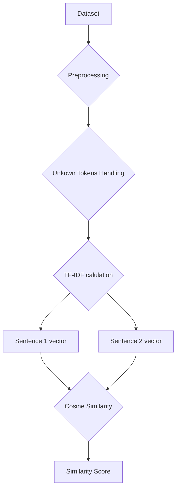
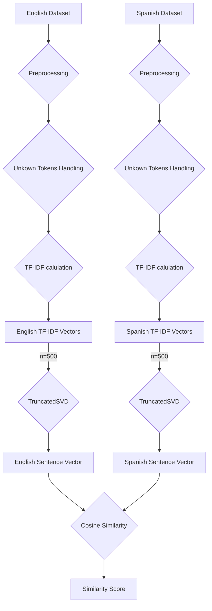
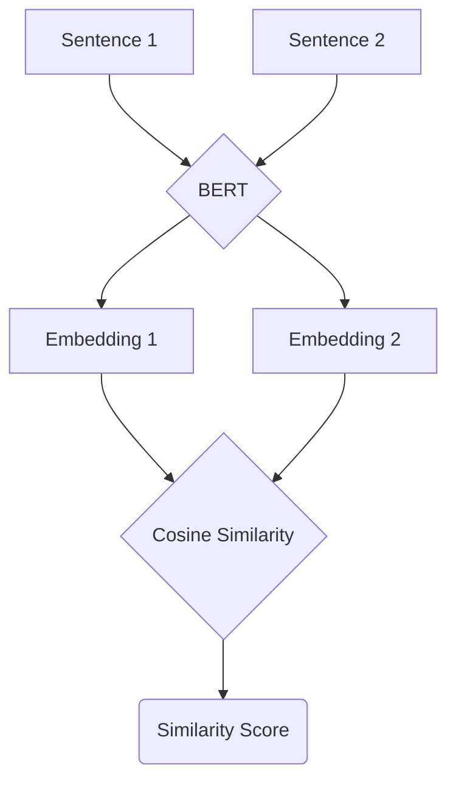

# Semantic Textual Similarity

### Relevant Links
* Presentation - [Canva](https://www.canva.com/design/DAE_d1_VMa4/wISWpqkKc-iRExPGlmGiNg/view?utm_content=DAE_d1_VMa4&utm_campaign=designshare&utm_medium=link2&utm_source=sharebutton)
* STS Dataset - [Papers with code](https://paperswithcode.com/dataset/sts-benchmark)
* BERT - [arXiv](https://arxiv.org/abs/1810.04805)

## Task

The task was to calculate degree of comparability in the underlying semantics of paired fragments of text is measured by Semantic Textual Similarity (STS). The model should yield a continuous valued similarity score on a scale of 0 to 5, with 0 indicating complete semantic independence and 5 representing semantic equivalence, when given two texts. The Pearson correlation between machine-assigned semantic similarity scores and human judgments is used to evaluate performance.

## Datasets Used

`STSBenchmark` - STS Benchmark comprises a selection of the English datasets used in the STS tasks organized in the context of SemEval between 2012 and 2017. The selection of datasets include text from image captions, news headlines and user forums.

`sts-2017-cross lingual dataset` - This was the dataset used for EN-ES semantic similarity.

## Base Model

For the base model, we had chosen a statistical approach to understand the similarities in the sentences. The approach taken was to use TF-IDF. 

### TF-IDF

"Term Frequency — Inverse Document Frequency" is abbreviated as TF-IDF. This is a method for calculating the number of words in a collection of documents. We usually assign each word a score to indicate its prominence in the document and corpus.

The formula for TF-IDF is as follows:

$$
\text{TF-IDF} = \text{Term Frequency(tf)} \times \text{Inverse Document Frequency(idf)}
$$

We’ll start by explain what **Term Frequency** and **Inverse Document Frequency** are.

### Term Frequency

This metric determines how often a word appears in a manuscript. This is greatly dependent on the document's length and the word's generality; for example, a relatively common word like "was" can appear many times in a document.

Remember that we need to vectorize the document at the end. When vectorizing papers, we must take into account more than just the words that appear in the content. If we do that, the vector lengths for both texts will be different, making it impossible to compute the similarity. So, we vectorize the documents based on the vocabulary. The corpus's vocabulary is a list of all possible universes.

The formula is

$$
\text{tf(t,d)} = \text{count of t in d} /\text{number of words in d}
$$

### Document Frequency

This metric assesses the value of texts throughout the corpus as a whole. The sole distinction between TF and DF is that TF is a frequency counter for a term t in document d, whereas DF is a count of term t occurrences in the document set N. DF stands for the number of documents in which the word appears.

$$
\text{df(t)} = \text{occurence of t in N documents}
$$

### Inverse Document Frequency

The IDF is the inverse of the document frequency, which assesses the informativeness of word $t$. When we calculate IDF, the most often occurring words, such as stop words, will have a very low value (since they are present in almost all of the texts, and $N/\text{df}$ will give that word a very low number). Finally, we have what we're looking for: relative weighting.

$$
\text{idf(t)} = N/\text{df}
$$

At query time, when the word is not present in is not in the vocab, it will simply be ignored. But in few cases, we use a fixed vocab and few words of the vocab might be absent in the document, in such cases, the $\text{df}$ will be 0. As we cannot divide by 0, we smoothen the value by adding 1 to the denominator.

$$
\text{idf(t)} = \log(N/(\text{df} + 1))
$$

The final formula for TF-IDF comes out to be 

$$
\text{tf-idf(t, d)} = \text{tf(t, d)} \times \log(\text{N}/(df + 1))
$$

### Pipeline

The following was the pipeline followed EN-EN semantic similarity calculation

1. Preprocessing the data
2. Handling unknown data
3. Calculation of TF-IDF scores for sentences
4. Cosine similarity was calculate for the sentence vectors

The approach followed for EN-ES followed was more or less similar but for the steps were done seperately for both language and the `TruncatedSVD` was used to bring the different dimensioned vectors for different languages to same dimensions for cosine similarity calculation.

### Results

| Dataset | Pearson Correlation | P-Value |
| --- | --- | --- |
| STS Benchmark en-en | 0.6946474539889476 | 0.0 |
| sts-2017-en-es | 0.0677572613808956 | 0.032 |

## Neural Network Approach

The key idea here was to first obtain the word embeddings using which we will generate the sentence embeddings. We then take the cosine distance between the sentences into consideration and find the similarity. We scale this value to match the provided similarity score range $[0,5]$.

### Word Embeddings

It is not practical to generate good word embeddings in the latent space on the small datasets of textual similarity. The vocabulary size is in the order of a couple of thousands. Even if we were to use the provided datasets, our word embeddings would not do justice to our model. Since the task was to perform Semantic Textual Similarity we use pre-trained models such as **FastText** and **Glove** to obtain embeddings.

### Sentence Embeddings

We are constructing an encoder that takes the word embeddings, learns the context of the sentence, and gives us the sentence embedding. We are using a **bidirectional LSTM** as the encoder. It takes a sequence of word embeddings and outputs a single vector.

Monolingual Architecture for Semantic Textual Similarity

Multilingual Architecture for Semantic Textual Similarity

A working example of our pipeline

### Encoder Model

We are using bidirectional LSTMs as an encoder. Given the word embeddings for a sentence, it can generate sentence embedding. It takes the dimension of the word embedding $100$ or $300$ and has a hidden layer size of $512$. It consists of two layers. We take the hidden state and mean pool over the various layers since its dimension is $(num\_layers*2, hidden\_dim)$ for bidirectional LSTMs.

### Training and Loss

Train the encoder model to learn the sentence vectors. Obtain the sentence embeddings of the sentences and compute the cosine distance between them. Apply MSE Loss on the similarity score generated and the ground truth.

We tried several other models such as adding some linear layers, non-linearity, and more LSTM layers but they seem to perform worse on the STS dataset.

### Results

English-English STS data performance analysis:

| Word Embeddings | Pearson Correlation |
| --- | --- |
| Glove | 0.75 |
| FastText | 0.55 |

English-Spanish STS data performance analysis:

| Word Embeddings | Pearson Correlation |
| --- | --- |
| FastText | 0.10 |

There is a major difference in the performance of the model based on the word embeddings. Glove embeddings seem to be more suited for this task and we can clearly see that FastText embeddings don’t provide good results. We didn’t want to use Bert embeddings since they are generated based on the sentence context.

## BERT Approach

The final approach we had decided to was to use BERT encodings to find the semantic similarity between the sentences. Before explaining our pipeline I would stress on what BERT is. 

BERT stands for Bidirectional Encoder Representations from Transformers. The use of the bidirectional training of Transformer, a popular attention model, to language modelling is BERT's fundamental technical breakthrough. In contrast to earlier research, which looked at a text sequence from left to right or a combination of left-to-right and right-to-left training, this study looked at a text sequence from left to right. The findings of the paper suggest that bidirectionally trained language models can have a better sense of language context and flow than single-direction language models. 

A Transformer tries to understand the relations between words or sub-texts. Transformer has two different mechanisms in its basic form: an encoder that reads the text input and a decoder that generates a job prediction. Only the encoder technique is required because BERT's purpose is to construct a language model.

### Pipeline

The following is the pipeline for using the BERT model

1. Generate embeddings using the `paraphrase-MiniLM-L6-v2` model.
2. Calculate the *cosine similarity* between the sentence embeddings.

### Results

| Dataset | Pearson Correlation | P-Value |
| --- | --- | --- |
| STS Benchmark en-en | 0.84 | 0.0 |
| sts-2017-en-es | 0.0062 | 0.8441 |

The results for English-Spanish dataset are seeming unfavorable. The problem with multilingual BERT (mBERT) and XLM-RoBERTa is that they provide poor sentence representation right out of the box. Furthermore, the vector spaces of different languages are not aligned, which means that phrases with the same content in different languages will be mapped to different positions in the vector space.

A possible way to overcome this is to use an approach proposed in ****[Making Monolingual Sentence Embeddings Multilingual using Knowledge Distillation](https://arxiv.org/abs/2004.09813).** The approach is built on a fixed (monolingual) **teacher** model that generates phrase embeddings with the qualities we want in a single language. The **student** model is expected to mirror the teacher model, which means that the teacher and the student model should map the same English text to the same vector. We train the student model on parallel (translated) texts in order for it to work in other languages. Each sentence's translation should be mapped to the same vector as the original sentence.